# Cosmos Homework 3

## Prob 2.0 : Parameters

Briefly explain the meaning of each of the six base cosmological parameters.

For the six base parameters in Table 1 (the following description is according to 2.1 section in the paper):

1. Ωbh² : baryon density of the universe, defined as Ωb = ρb/ρcrit, where ρcrit is critical density. The h here defined as h ≡ H0 / (100 kms⁻¹ Mpc⁻¹).
2. Ωch² : cold dark matter density.
3. 100θMC: an approximation to the observed angular size of the sound horizon at recombination.
4. τ : optical depth at reionization.
5. ln(10¹⁰ As): initial super-horizon amplitude of curvature perturbations (at k = 0.05 Mpc⁻¹).
6. ns : primordial spectral index.

Flat priors were applied on these parameters.

## Prob 2.1 : Install the code

I prefer to use `pipenv`, so build the environment first by:

```
pipenv install numpy scipy matplotlib pylint --dev
```

and then install `CAMB`,

```
pipenv install camb
```

enter the env by,

```
pipenv shell
```

Clone `CLASS`

```
git clone https://github.com/lesgourg/class_public.git class
```

Try to compile the `CLASS`:

```bash
cd class/
make

# ModuleNotFoundError: No module named 'Cython'
```

I hope they said we need `Cython` before I ran `make`.
Back to install `Cython` to env:

```bash
pipenv install cython

Installing cython…
Adding cython to Pipfile's [packages]…
✔ Installation Succeeded 
Pipfile.lock (f3d047) out of date, updating to (b68964)…
Locking [dev-packages] dependencies…
Locking [packages] dependencies…
✔ Success! 
Updated Pipfile.lock (f3d047)!
Installing dependencies from Pipfile.lock (f3d047)…
  🐍   ▉▉▉▉▉▉▉▉▉▉▉▉▉▉▉▉▉▉▉▉▉▉▉▉▉▉▉▉▉▉▉▉ 19/19 — 00:00:
```

Rerun `make`:

```
cd class/
make clean
make
```

Few warning no errors.

```bash
./class explanatory.ini

# Running CLASS version v2.7.2 ...
# Writing output files in output/explanatory01_... 
```

Try python `import`:

```python
import classy
# and nothing happened
```

Since it sneakly installed the classy package, it's not recorded in `Pipfile`.

## Prob 2.2 Power Spectrum

**a) Write code to generate a theoretical primary CMB temperature power spectrum for a flat universe with the default cosmological parameters.**

Note :  `ns` and `As` in `InitPower.set_params`.

in my `camb_power_spec.py`:

```python
# setup six init params from the paper
params = camb.CAMBparams() # the obj stores params
params.set_cosmology(
    ombh2=0.022383, omch2=0.122011,
    thetastar=0.0104, omk=0, tau=0.0543)
params.InitPower.set_params(
    As=np.exp(3.0448) * 1e-10, ns=0.96605)
```

The code complains about : `camb.baseconfig.CAMBError: Set H0=None when setting theta`  
so I skipped setting H0.

The plot:

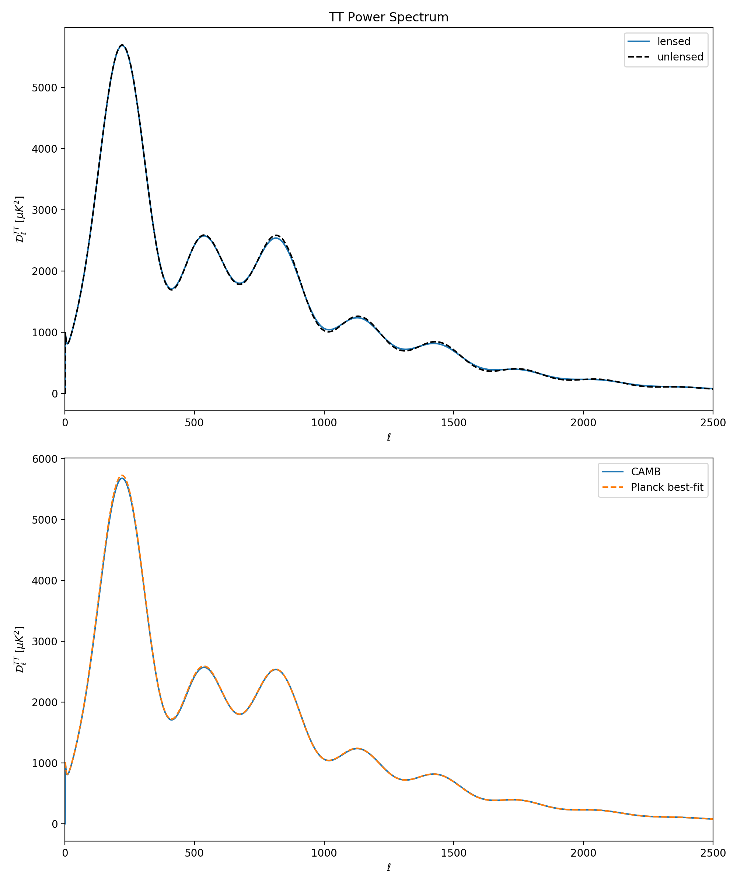

**b) Compare this result to Figure 1 of https://arxiv.org/abs/1807.06209. Do your results look similar?**

Yes.

## Prob 2.3 Baryons in the CMB

**a) Increase Ωbh2 , while keeping H0 fixed, so that Ωb changes.**

Result: first peak becomes higher, second & third peak shifts to smaller scales.  

The first peak position is not changed a lot because the universe fixed at flat curvature.  
Since Ωb increases, the sound speed (cs) decreases.
Because l ∝ current horizon / sound speed horizon ∝ 1 / cs  
So that I expected l would increases.
And the result shows l increase a little at first peak and a lot at second and third peak.

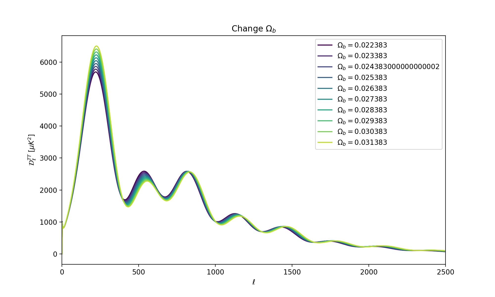

**b) Now, keeping Ωbh2 fixed, set H0 = 75 km/s/Mpc and thus change Ωb.**

```bash
python camb_change_baryon.py
```

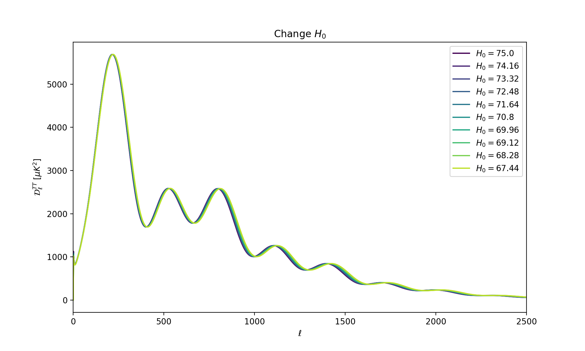

As shown in the Fig, increase H0 would shift the peak positions to larger scales.
It makes sense since if the expansion rate is larger than the structure would be larger.

## Prob 2.4 Curvature

**a) Write code to generate a CMB temperature power spectrum for a closed universe with |ΩK| = 0.1.
Keep ΩMh2, H0 and Ωbh2 constant and vary ΩL**

```
python camb_change_curvature.py
```

```python
    params.set_cosmology(
        H0=67.4, ombh2=0.022383,
        omch2=0.122011, omk=omk, tau=0.0543)
    params.InitPower.set_params(
        As=np.exp(3.0448) * 1e-10, ns=0.96605)
```

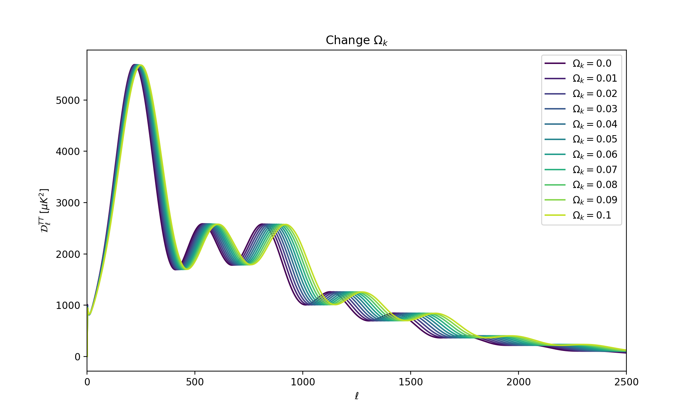

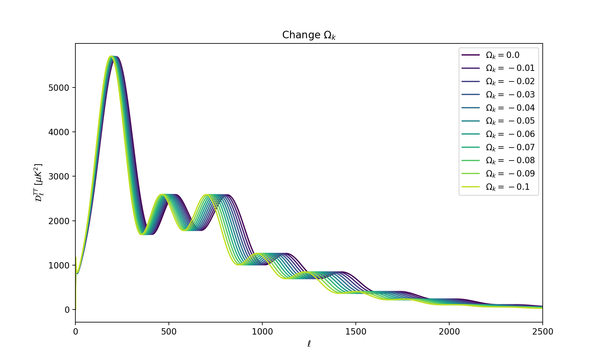

**b) Explain the changes between these two power spectra**

Increase curvature would move peaks to smaller scales.
It makes sense since if the space is more curved then there would be more small scale structures.

Changing dark energy density is equal to changing ΩK to negative so I just plot negative ΩK instead of ΩL.
The reason is that universe would become negative curved if we do not take into account the missing energy- the dark energy.

## Prob 2.5 Massive Neutrinos and the CMB power spectrum

**a) Write code to generate a theoretical primary CMB temperature power spectrum with the default cosmological parameters, but a total neutrino mass (in three neutrino species) of Σm ν = 1 eV.**

Slight modification again,

```python
    # setup six init params from the paper
    params = camb.CAMBparams() # the obj stores params
    params.set_cosmology(
        H0=67.4, ombh2=0.022383,  
        omch2=0.122011, omk=0, tau=0.0543,
        mnu=mnu, neutrino_hierarchy='degenerate')
    params.InitPower.set_params(
        As=np.exp(3.0448) * 1e-10, ns=0.96605)
```

and run (range mν from 0eV ~ 1eV)

```bash
python cmb_change_neutrino.py
```

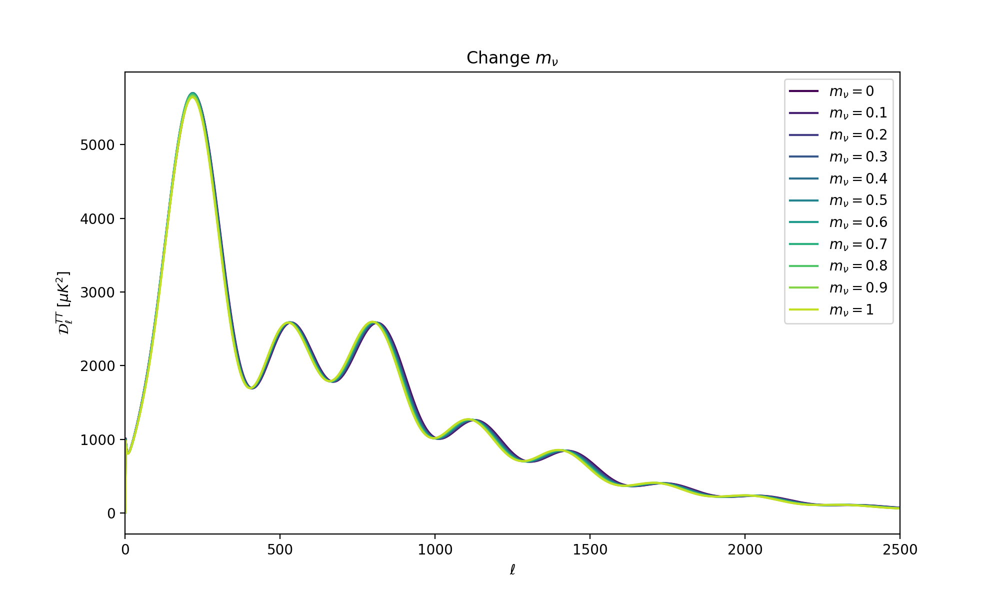

Note:
- normal hierarchy, where m1 < m2 << m3
- inverted hierarchy, where m1 = m2 >> m3
- degenerate, where m1 = m2 = m3

**b) Plot this CMB power spectrum on the same graph as the default power spectrum from Problem 2.2 and explain the differences between them.**

The line with mν = 0 is the default power spectrum.

It seems to shift the power spectrum to larger scales and suppress the amplitude in first peak a little.

Adding more neutrino to universe would shift the matter-radiation equality epoch and would also supress the growth of perturbations.

I think because neutrino would contribute to radiation density.
The matter-radiation equality happens later.
So the general trend of power spectrum shifts to larger scales.

Also, the free-streaming of the neutrino would suppress the growth of the structures in small scales.

## Prob 2.6 The Matter Power Spectrum

**a) Compute the linear theory matter power spectrum at z = 0 for the default cosmology**

```bash
python camb_matter_power.py

# Sigma 8 is 0.82
```

Basically used the following lines to compute

```python
# compute linear spectrum
results   = camb.get_results(params)
kh, z, pk = results.get_matter_power_spectrum(
    minkh=1e-4, maxkh=1, npoints=200)

# get sigma8
sigma_8 = results.get_sigma8()
```

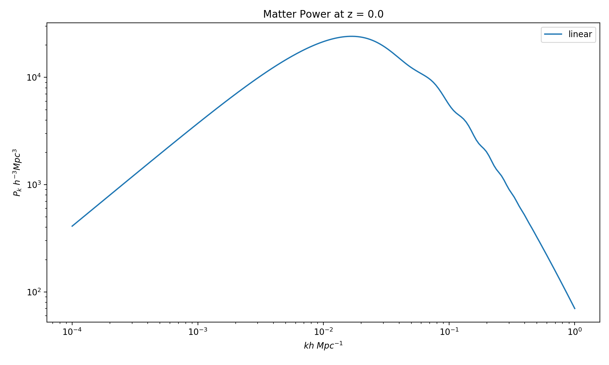

**b) Calculate σ 8 for this power spectrum using CAMB and explain what σ 8 means.**

The σ8 is 0.82. The σ8 is the measure of amplitude on the linear power spectrum at scale of 8 h⁻¹Mpc.

## Prob 2.7 The Linear Growth Function

**a) Compute the linear theory matter power spectrum at z = 1, 2, 9 for the default cosmology.**

Run,

```bash
python camb_linear_growth_function.py

# Linear growth rate between z = 0.0 ~ 1.0 is 2.7261116656268225
# Linear growth rate between z = 1.0 ~ 2.0 is 2.1162510300665964
# Linear growth rate between z = 2.0 ~ 9.0 is 10.785505159886952
```

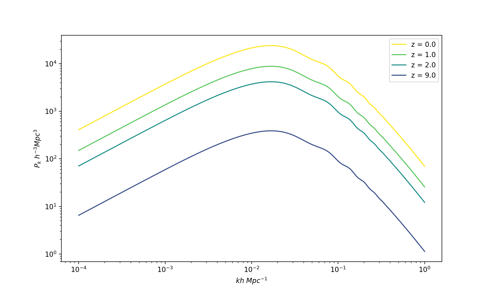

**b) Compute the linear growth function from z = 1 − 0, z = 2 − 1 and z = 9 − 2 by taking the ratio of the appropriate power spectra.**

To take the ratio, I just doing this D = 1/N Σ ( Pk(z = z2) / Pk(z = z1) ).

- Linear growth rate between z = 0.0 ~ 1.0 is  2.73
- Linear growth rate between z = 1.0 ~ 2.0 is  2.19
- Linear growth rate between z = 2.0 ~ 9.0 is 10.79

**c) Compute the linear growth function between these redshifts analytically for a matter-dominated universe and a Λ-dominated universe.**

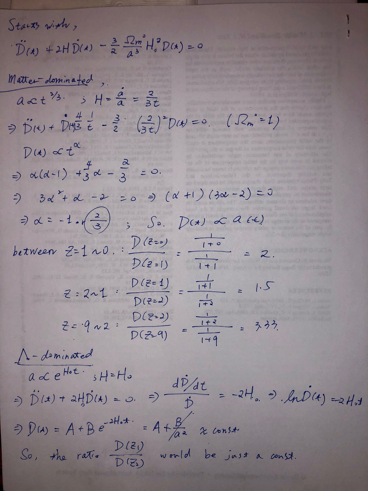
<!--  -->

**d) Using Halofit, compute the non-linear matter power spectrum at z = 0, 1, 2, 9.**

Just follow the prescription of CAMB:

```python
# compute non-linear power spectra
params.NonLinear = camb.model.NonLinear_both
results.calc_power_spectra(params)

kh_nl, zs_nl, pks_nl = results.get_matter_power_spectrum(
    minkh=1e-4, maxkh=1, npoints=200)
```

Run,

```bash
python camb_non_linear_spectrum.py
```

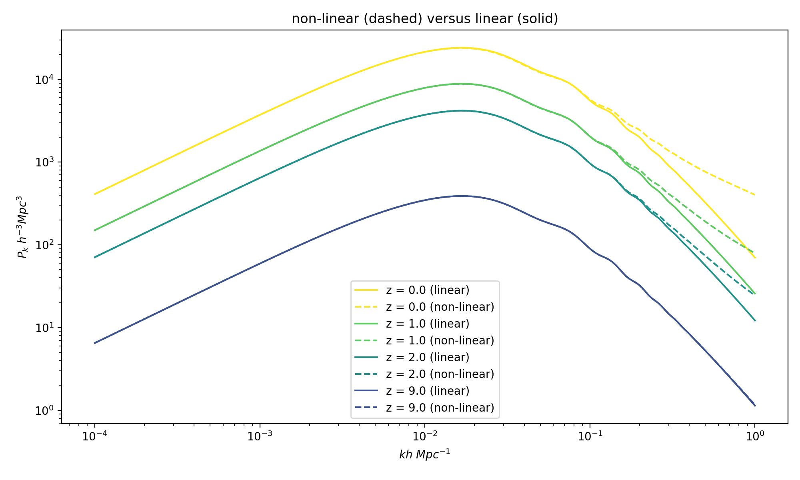

If we consider non-linear contribution to the structure, then there would be more small structures there in the universe.
And the number of small structures would increase with the evolution of the universe; therefore, we find more power in the small scales for the lower redshifts.

## Problem 2.8 Massive Neutrinos and the Matter Power Spectrum

**a) Compute the linear theory matter power spectrum at z = 0 for the same massive neutrino cosmology as in Problem 2.5.**

Run,

```bash
python camb_neutrino_matter_power.py

# Default sigma_8 = 0.8199066677783182
# Add neutrino, sigma_8 = 0.6801072173615291
# Add neutrino, change Omega_cdm, sigma_8 = 0.6325463067013503
```

This is what I get,

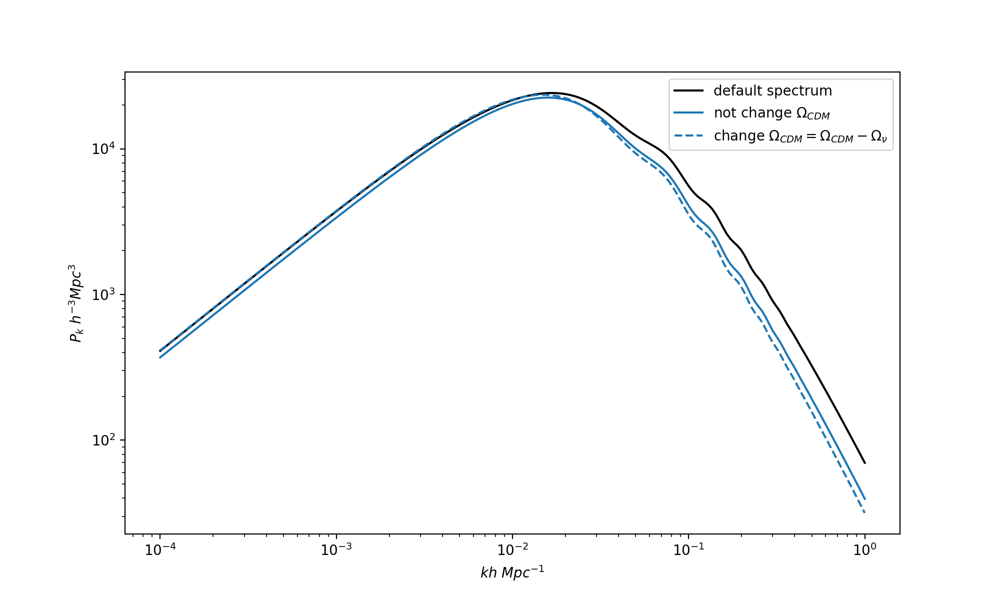

**b) Plot both matter power spectra and comment on the changes.**

As shown in previous plot.

On the largest scales, the perturbations basically are not affected by free-streaming neutrino, which implies the effect of neutrino could be considered similar to CDM.
While there exists a power shift at large scales between change Ωcdm or not change it.
This implies the large scales only depend on the fraction of matter in the universe instead of neutrino mass.

On the small scale side, there's a noticeable suppression on the amplitude.
This means the increasing amount of free-streaming neutrino would suppress the small structure growth, and reflects itself on the matter power spectrum.
It makes sense since if we consider the matter power spectrum includes the neutrino,

P(k) ∝ < |Ωcdm δcdm + Ωb δb + Ων δν| >.

On the small scales, the current day δcdm and δb would be similar while δν would be smaller than δcdm (means no neutrino halo or cluster).
In general, the power would be reduced.

**c) Compute σ 8 for the massive neutrino cosmology.**

- Default σ8 = 0.82
- Add neutrino, σ8 = 0.68
- Add neutrino, change Ωcdm, σ8 = 0.63

## Problem 2.9 The Baryon Acoustic Oscillation Feature

**a) From the matter power spectrum for the default cosmology, identify the Baryon Acoustic Oscillation feature. What is the scale of this feature in comoving Mpc?**

Run `python camb_bao.py`,

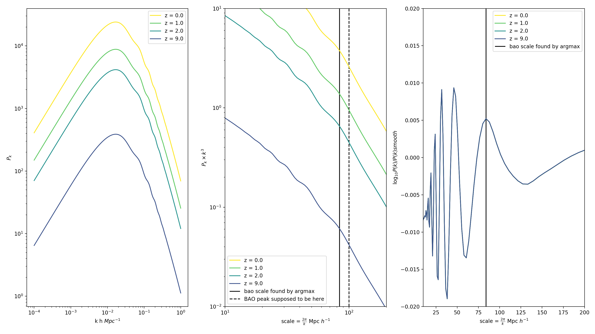

I did not get the right scale.
The first turn-over peak corresponds to ~0.017 h/Mpc ~ 0.01/Mpc ~ 2π / 0.01 Mpc = 628 Mpc, which is the horizon size at matter-radiation equality.
The following wiggles should be BAO.
Fit the wiggles by my eyes, I think,

- The first wiggle ~ 125 Mpc
- The second wiggle ~ 75 Mpc

But the right scale for BAO is 150 Mpc.

And the peak in my plot is very unobvious, which implies I might did something wrong.

I spend 6 hours on this single question, I should move on.

**b) Identify the same feature in the CMB power spectrum. What is the scale of this feature in comoving Mpc in the CMB?**

- For first peak, L = scale = 1.4*10^4 Mpc * π/220 = 199 Mpc.
- For second peak, L = scale = 1.4*10^4 Mpc * π/530 = 83 Mpc

(1.4*10^4 is the particle horizon size)

**c) Identify the same feature in the z = 1, 2, 9 matter power spectra, giving the scale in comoving Mpc at each redshift.**

Fitted by my eyes, I think

- for z = 1 : first wiggle ~ 125 Mpc
- for z = 2 : first wiggle ~ 120 Mpc
- for z = 9 : first wiggle ~ 110 Mpc

**d) Explain why measuring the Baryon Acoustic Oscillation scale is useful for cosmology.**

Because the size of BAO only depends the physics (model) we used,
it would be a nice cosmic ruler to determine the expansion of the universe
So we can measure the expansion between recombination and today.
It would help us to better constrain the accelerating expansion and the property of dark energy.

Reference:

- neutrino :
  - https://arxiv.org/pdf/1309.5383.pdf 
  - https://arxiv.org/pdf/1212.6154.pdf
- BAO :
  - http://w.astro.berkeley.edu/~mwhite/bao/
  - https://arxiv.org/pdf/1105.1514.pdf
  - 1.3.10: https://cosmologist.info/teaching/EU/ADC_Structure_formation2.pdf
  - http://zuserver2.star.ucl.ac.uk/~hiranya/PHAS3136/PHAS3136/PHAS3136_files/Cosmo6_101112_cmbpower.pdf
  - http://icc.ub.edu/~liciaverde/TALKS/cosmo6.pdf
  - https://adh-sj.info/bao_cmb.php
  - https://physics.stackexchange.com/questions/104010/connection-between-bao-und-cmb-spectrum