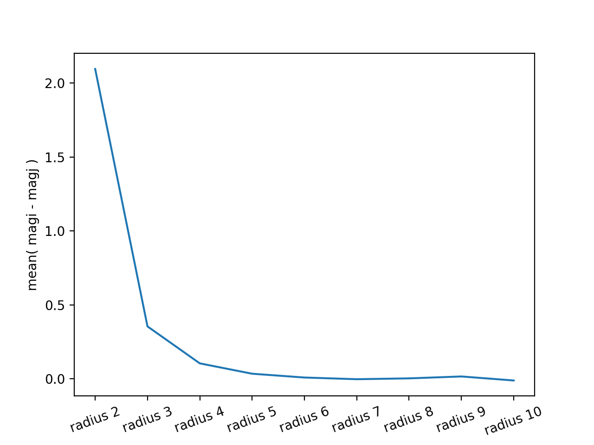

# Aperture Corrections

Download the image first (alpha = 03:54:38, delta = +00:28:00)

```cs
display Landolt_95V.fits 1

epar rimexam
# fittype = gaussian
# buffer  = 10
# width   = 10
# magzero = 25
# rplot   = 15

# save and quit

imexam
# use cursor identify 7 objects
```

Change radius type `: raidus 2` (change to radius 2).  
One sneaky thing is that I am unable to type `:` in the terminal but able to type outside of the terminal.
And, I am unable to type `radius 2` outside the terminal and I only be able to type in terminal. Weird🤨.

first,

```cs
#   COL    LINE    RMAG     FLUX      SKY   N  RMOM ELLIP    PA     PEAK GFWHM
 128.00   97.54   14.45  16628.0  7322.00   2  0.83 1.000  90.0 10494.29  1.73
 127.84   97.50   13.10  57809.0  7322.00  14  2.08 0.065 -64.7  9378.73  2.49
 127.87   97.55   12.96  65631.0  7322.00  28  2.43 0.047 -27.8  9402.92  2.49
 127.88   97.53   12.94  66834.0  7322.00  50  2.52 0.163 -17.2  9387.85  2.49
 127.90   97.52   12.93  67360.0  7322.00  80  2.61 0.653 -40.2  9359.61  2.50
 127.91   97.53   13.00  63201.0  7348.00 112  1.88 1.391 -33.3  9336.80  2.49
 127.90   97.52   13.07  59141.0  7348.00 154 INDEF INDEF -18.4  9332.30  2.49
 127.91   97.52   13.11  57273.0  7348.00 198 INDEF INDEF -35.8  7551.09  3.93
 127.93   97.51   13.06  59683.0  7348.00 255  0.79 2.710 -13.3  7415.63  4.15
 128.05   97.53   13.04  60740.0  7348.00 313  2.44 0.466 -11.1  7294.71  4.39
```

second,

```cs
#   COL    LINE    RMAG     FLUX      SKY   N  RMOM ELLIP    PA     PEAK GFWHM
 197.00  192.25   13.99  25358.0  7306.00   2  0.92 1.000  90.0 13194.22  3.63
 197.08  192.38   12.27 123741.0  7319.00  13  2.23 0.110 -72.5 13433.44  4.09
 197.02  192.21   11.89 175797.0  7319.00  29  2.93 0.076 -72.4 13392.68  3.86
 197.02  192.28   11.80 191235.0  7319.00  49  3.24 0.052 -68.3 13492.28  3.76
 197.06  192.32   11.78 193698.0  7345.00  78  3.34 0.100 -73.7 13531.96  3.72
 197.05  192.34   11.78 194364.0  7358.00 112  3.41 0.129  89.9 13566.42  3.70
 197.04  192.36   11.78 194835.0  7358.00 155  3.46 0.191  80.4 13589.78  3.69
 197.02  192.36   11.76 197913.0  7358.00 199  3.78 0.207  89.5 13588.15  3.69
 197.00  192.39   11.75 199914.0  7365.00 254  4.12 0.140 -77.5 13599.65  3.68
 197.00  192.39   11.74 200453.0  7358.00 310  4.06 0.166 -76.7 13606.82  3.69
```

third,

```cs
#   COL    LINE    RMAG     FLUX      SKY   N  RMOM ELLIP    PA     PEAK GFWHM
 211.43  241.99   13.93  26714.0  7332.00   2  0.84 1.000   0.1 12952.40  5.13
 211.35  242.92   12.06 149573.0  7332.00  13  2.28 0.124   6.3 14686.95  4.91
 211.23  242.96   11.62 225521.0  7345.00  28  3.03 0.063   9.8 14761.70  4.46
 211.31  242.88   11.47 258224.0  7352.00  51  3.48 0.025   4.5 14919.85  4.25
 211.34  242.87   11.43 268427.0  7352.00  78  3.71 0.030 -10.9 14988.31  4.20
 211.30  242.90   11.41 273174.0  7352.00 111  3.85 0.063 -35.1 14937.06  4.20
 211.29  242.90   11.40 274767.0  7352.00 154  3.92 0.157 -37.2 14918.89  4.20
 211.27  242.92   11.41 273791.0  7352.00 200  3.88 0.286 -43.4 14903.15  4.21
 211.25  242.94   11.38 280492.0  7332.00 253  4.23 0.426 -37.3 14907.20  4.22
 211.29  242.92   11.41 273077.0  7345.00 311  3.63 0.580 -26.9 14918.69  4.21
```

fourth,

```cs
#   COL    LINE    RMAG     FLUX      SKY   N  RMOM ELLIP    PA     PEAK GFWHM
 207.64  395.00   14.23  20270.0  7203.00   2  0.85 1.000   0.0 11060.00  2.77
 207.59  395.55   12.68  84507.0  7203.00  12  2.04 0.034   1.5 12589.29  2.82
 207.68  395.58   12.40 109962.0  7196.00  29  2.64 0.016 -25.7 12527.07  2.84
 207.68  395.58   12.35 115103.0  7196.00  51  2.85 0.070 -47.9 12529.90  2.84
 207.62  395.56   12.33 116571.0  7196.00  79  2.96 0.196 -41.1 12580.49  2.83
 207.59  395.55   12.30 120625.0  7196.00 115  3.37 0.307 -52.3 12573.35  2.83
 207.56  395.54   12.31 119634.0  7196.00 153  3.22 0.257 -45.5 12543.06  2.83
 207.55  395.55   12.33 117073.0  7196.00 208  2.68 0.245  32.9 12528.43  2.84
 207.53  395.55   12.32 117818.0  7196.00 256  2.89 0.387  51.7 12502.08  2.84
 207.54  395.55   12.36 113542.0  7203.00 316  1.25 2.970 -78.3 12520.97  2.83
```

fifth,

```cs
#   COL    LINE    RMAG     FLUX      SKY   N  RMOM ELLIP    PA     PEAK GFWHM
 284.43  246.13   17.54    966.0  7313.00   3  1.09 0.559 -30.9   599.81  1.00
 281.79  249.84   12.51  98724.0  7313.00  12  2.07 0.092  10.1 12846.49  3.44
 281.89  249.88   12.20 132413.0  7313.00  27  2.67 0.068 -37.9 12831.94  3.30
 281.88  249.91   12.11 143260.0  7313.00  48  2.98 0.025 -28.1 12837.94  3.27
 281.84  249.88   12.06 149744.0  7313.00  77  3.27 0.063  55.0 12890.87  3.25
 281.82  249.86   12.06 149989.0  7313.00 113  3.29 0.020  63.6 12921.47  3.24
 281.86  249.82   12.06 150260.0  7313.00 154  3.32 0.087 -86.7 12923.63  3.24
 281.88  249.82   12.04 152071.0  7313.00 200  3.60 0.254 -82.3 12906.52  3.25
 281.88  249.82   12.03 153778.0  7313.00 252  3.88 0.301 -62.7 12904.91  3.25
 281.88  249.84   12.01 157628.0  7313.00 311  4.59 0.391 -47.0 12889.59  3.25
```

sixth,

```cs
#   COL    LINE    RMAG     FLUX      SKY   N  RMOM ELLIP    PA     PEAK GFWHM
 330.41  303.00   13.87  28330.0  7333.00   2  0.84 1.000   0.0 15401.14  2.77
 330.44  304.26   11.86 179970.0  7333.00  13  2.33 0.133  46.7 15144.81  8.03
 330.43  304.35   11.23 322995.0  7333.00  29  3.31 0.066 -22.9 15507.76  6.29
 330.45  304.39   10.97 410100.0  7333.00  52  3.98 0.020 -43.5 15801.58  5.66
 330.42  304.42   10.88 444074.0  7320.00  79  4.35 0.039 -44.1 15929.75  5.47
 330.44  304.44   10.84 461030.0  7320.00 114  4.61 0.034 -38.4 15996.38  5.39
 330.45  304.44   10.82 467915.0  7333.00 153  4.78 0.039 -44.4 16000.55  5.36
 330.47  304.45   10.81 475541.0  7320.00 208  4.97 0.081 -57.8 16030.65  5.35
 330.47  304.45   10.80 476804.0  7320.00 256  5.02 0.145 -75.5 16031.02  5.35
 330.47  304.44   10.80 478796.0  7320.00 316  5.11 0.148 -71.1 16030.09  5.35
```

seventh,

```cs
#   COL    LINE    RMAG     FLUX      SKY   N  RMOM ELLIP    PA     PEAK GFWHM
 496.56  278.12   13.66  34353.0  7269.00   3  1.15 0.500  46.0 13542.58  2.66
 496.52  278.38   12.52  98377.0  7287.00  12  2.08 0.045 -22.4 13241.23  3.15
 496.68  278.25   12.22 129406.0  7269.00  29  2.67 0.050 -16.9 13403.98  3.07
 496.62  278.30   12.15 138590.0  7269.00  51  2.99 0.098 -24.6 13493.96  3.04
 496.61  278.32   12.14 139492.0  7269.00  80  3.04 0.138 -21.2 13504.41  3.04
 496.57  278.33   12.10 144222.0  7235.00 115  3.31 0.179 -42.4 13511.09  3.05
 496.56  278.34   12.07 148975.0  7235.00 155  3.80 0.146 -51.7 13501.47  3.05
 496.57  278.34   12.03 153793.0  7235.00 203  4.36 0.090  -7.7 13517.92  3.05
 496.59  278.31   12.04 152338.0  7243.00 256  4.29 0.087  -0.4 13513.84  3.05
 496.59  278.28   12.10 145167.0  7269.00 316  3.64 0.246  -0.2 13480.50  3.04
```

To get the table, run

```bash
python print_grwoth_curve_table.py
```

```cs
This is the table you want :
    radius 2  radius 3  radius 4  radius 5  radius 6  radius 7  radius 8  radius 9  radius 10
0      2.01      0.63      0.26      0.09      0.04      0.02      0.01      0.01       0.00
1      1.14      0.30      0.07      0.01      0.04      0.03      0.04     -0.01      -0.06
2      1.55      0.28      0.05      0.02      0.03     -0.01     -0.02      0.01      -0.04
3      1.35      0.14      0.02      0.01     -0.07     -0.07     -0.04      0.05       0.02
4      1.87      0.44      0.15      0.04      0.02      0.01     -0.01      0.03      -0.03
5      5.03      0.31      0.09      0.05      0.00      0.00      0.02      0.01       0.02
6      1.72      0.38      0.09      0.02      0.00      0.00      0.02      0.01       0.01


And here is the summary :
        radius 2  radius 3  radius 4  radius 5  radius 6  radius 7  radius 8  radius 9  radius 10
count  7.000000  7.000000  7.000000  7.000000  7.000000  7.000000  7.000000  7.000000   7.000000
mean   2.095714  0.354286  0.104286  0.034286  0.008571 -0.002857  0.002857  0.015714  -0.011429
std    1.327703  0.152955  0.079552  0.028785  0.038483  0.032514  0.027516  0.019024   0.031848
min    1.140000  0.140000  0.020000  0.010000 -0.070000 -0.070000 -0.040000 -0.010000  -0.060000
25%    1.450000  0.290000  0.060000  0.015000  0.000000 -0.005000 -0.015000  0.010000  -0.035000
50%    1.720000  0.310000  0.090000  0.020000  0.020000  0.000000  0.010000  0.010000   0.000000
75%    1.940000  0.410000  0.120000  0.045000  0.035000  0.015000  0.020000  0.020000   0.015000
max    5.030000  0.630000  0.260000  0.090000  0.040000  0.030000  0.040000  0.050000   0.020000
```

To get Aperture correction table, do the cumulative sum `df.mean()[::-1].cumsum()[::-1]`,

```cs
Aperture correction table :
radius 2     2.601429
radius 3     0.505714
radius 4     0.151429
radius 5     0.047143
radius 6     0.012857
radius 7     0.004286
radius 8     0.007143
radius 9     0.004286
radius 10   -0.011429
```

I am too lazy to change 2 to 1, so just leave the first number to be 2 there.

The mean( magi - magj ) plot is,



**Question: For the typical star in the field, based on the table above, at what radius do you think you are including virtually all the flux of the star?**

Since on the above plot, there's still a negative slop until radius 6.
I would count until radius 6, and use the aperture correction value at radius 6 to subtract from the magnitude I measured.