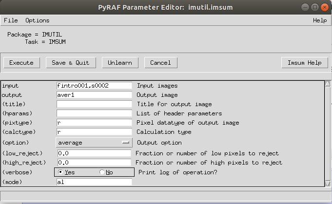
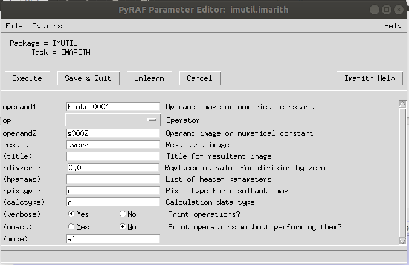
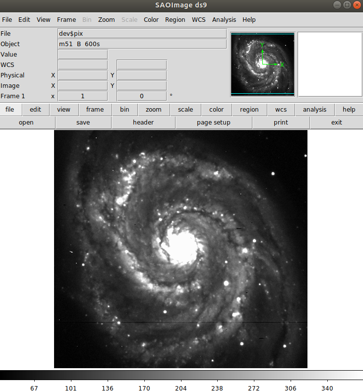
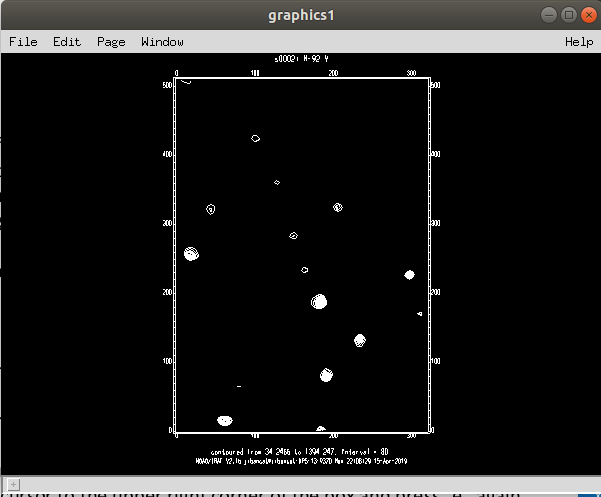
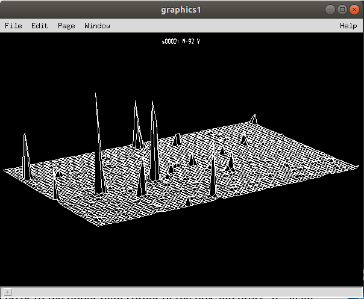
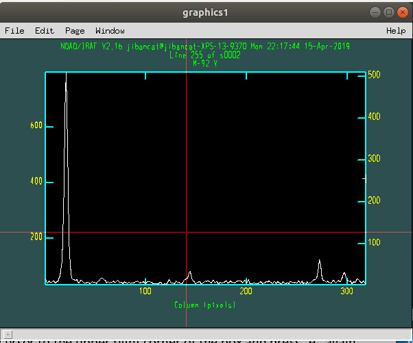
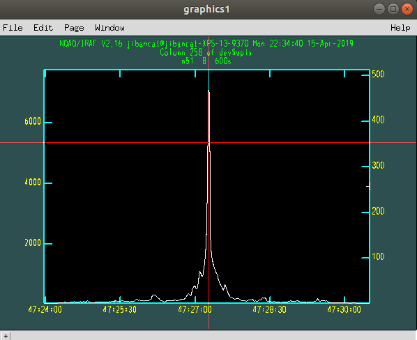
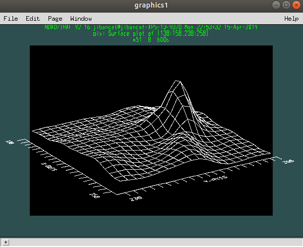
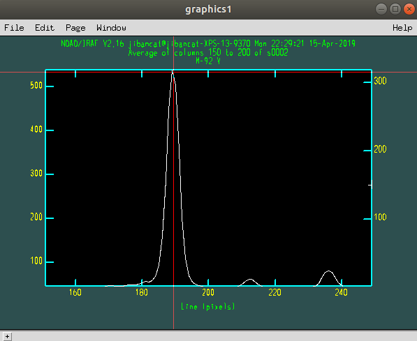

# Tutorial

- Open pyraf using command `>> pyraf`
- Files for the tutorials are, `fintro0001.fits` and `fintro0002.fits`. They are secret image files provided by the instructor, so I probably shouldn't put them here.

```bash
# overview
path
dir
dir *.fits
dir uparm
dir l+
package
help images
phelp imheader
<space bar>          # go to next page
b                    # go back one page
?                    # view options
q                    # quit the help
lpar imheader        # list task parameters
imhead fintro0001    # see header
imhead fintro0001 l+ # see a longer header
```

- Open image :
  - run `--> !ds9 &` in the background
  - display fintro0001.fits in frame 1 : `--> display fintro0001 1`
  - display fintro0001.fits in frame 2 : `--> display fintro0001 2`
  - Blink them : **frame** 👉 **blink** 😉

- Examine the images:
  - `--> unlearn imexamine` and `--> imexamine`
  - get info from cursor : `a`
  - get radial profile from cursor : `r`
  - switch frame : `d`
  - quit : `q`

- Shift the image frame :
  - shift fintro0002.fits with (dx, dy) = (-0.56, -1.65) and save the result to s0002.fits `--> imshift fintro0002 s0002 -0.56 -1.65`

- Averaging
  - `imsum` : Take an average 
  - `imarith` : Adding up 
  - Dividing by 2 : `--> imarith aver2 / 2 aver2`

- Statistics
  - `--> unlearn imstatistics` and `--> imstat aver*.fits`

```bash
--> imstat aver*.fits
#               IMAGE      NPIX      MEAN    STDDEV       MIN       MAX
           aver2.fits    161862     46.75     86.35     8.509     8607.
```

- Show the pretty galaxy image
  - 🌌 `display dev&pix 1` 
  - This is the **IRAF** *secretly hidden image*, M51.

- Plotting :
  - make sure the file you want to plot is **in the frame you're opening in the ds9**, and type : `--> contour s0002` 
  - surface plot : `--> surface s0002` 
  - not-sure-what-it-is quite-interactive plot : `--> implot s0002`  👇
    - `c` - column plot
    - `:l 100` - plot line 100 (not sure what it means, guess it is plotting y-profile on `x==100`)
    - `:c 150 200` - plot average of columns 150-200 (guess it is averaging y-profile of 150 < x < 200)
    - `e` - zoom in
    - `r` - get back
    - `q` - bye bye 🤞

- Plot the secret image distributed by the IRAF system
  - `--> implot dev$wpix`
  - show ra dec coord : `:w world`
  - convert to `hh:mm:ss` : `:f %H`
  - pointing at the peak and hit `c` to get a column plot (have no idea what is a "column plot")
  - convert to `dd:mm:ss` : `:f %h` 

- Play round with `imexamine`
  - list cursor options : `?`
  - printout pixel values : `z`
  - show statistics : `m`

```bash
#            SECTION     NPIX     MEAN   MEDIAN   STDDEV      MIN      MAX
   [222:226,129:133]       25     948.     734.    762.5     215.    3047.
```

- More options :
  - surface plot : `s` 
  - plot a line : `l`
  - interactive cursor mode : `g` 👉 give up : `i`
  - bye bye : `q`

- Remember the how to close IRAF ☺️

```bash
# in IRAF
cl> logout (IRAF)

# in PyRAF
--> .exit
```

n.b. Unfortunately, I was unable to close those little windows that PyRAF opened without my permission. So I terminate the terminal lol

## Q1 : What information does the short header listing contain?

```
--> imhead fintro0001

fintro0001[318,509][real]: M-92 V
```

## Q2 What is the exposure time of image fintro0001.fits?

```bash
--> imheader fintro0001 l+ | grep EXPTIME

EXPTIME =                   60  /  ACTUAL INTEGRATION TIME (SECONDS)
```

## Q3 Compute the average shift, i.e., What shift should you apply to the second image so that it aligns with the first?

- Get three targets first 👇

In `--> imexamine`, push your `a` for three times in selected three targets (I pushed 4 times anyway)

```bash
#   image name: fintro0002
#   COL    LINE   COORDINATES
#     R    MAG    FLUX     SKY    PEAK    E   PA BETA ENCLOSED   MOFFAT DIRECT
 183.79  189.22 183.79 189.22
   8.31  12.30 120676.   44.59  10491. 0.08   86 2.44     2.81     2.78   2.77
 234.32  134.26 234.32 134.26
   8.06  13.37  44877.    43.4   3997. 0.04   84 2.37     2.71     2.73   2.69
 192.09   82.98  192.09 82.98
   8.19  12.59  91766.   44.26   8023. 0.04   89 4.70     2.77     2.85   2.73
 298.82  228.24 298.82 228.24
   8.44  13.42  43044.   44.29   3604. 0.04   67 2.89     2.85     2.87   2.81

#   image name: fintro0002
#   COL    LINE   COORDINATES
#     R    MAG    FLUX     SKY    PEAK    E   PA BETA ENCLOSED   MOFFAT DIRECT
 184.36  190.85 184.36 190.85
   9.73  12.28 122362.   44.35   7980. 0.15  -87 11.3     3.27     3.39   3.24
 234.85  135.91 234.85 135.91
   9.71  13.36  45341.    43.7   3019. 0.09  -84 4.52     3.27     3.32   3.24
 192.65   84.63  192.65 84.63
   9.78  12.58  92793.    43.9   6243. 0.12  -77 4.99     3.28     3.30   3.26
 299.36  229.92 299.36 229.92
   9.93  13.42  43047.   43.84   2760. 0.10  -84 4.96     3.34     3.57   3.31
```

- So coordinates of fist & second:  

| `fintro0001`         | `fintro0002`         | Offsets (`fintro0002` - `fintro0002`) |
| ------------------ | ------------------ | ---------------------------------- |
| ( 183.79, 189.22 ) | ( 184.36, 190.85 ) | ( 0.57, 1.63 )                     |
| ( 234.32, 134.26 ) | ( 234.85, 135.91 ) | ( 1.53, 1.65 ) 👉 *exclude outlier* |
| ( 192.09, 82.98 )  | ( 192.65, 84.63 )  | ( 0.56, 1.65 )                     |
| ( 298.82, 228.24 ) | ( 299.36, 229.92 ) | ( 0.54, 1.68 )                     |

- Average offset: ~ ( 0.56, 1.65 )

```bash
# shift the fintro0002 with the above offset and
# save the file to s0002.fits
--> imshift fintro0002 s0002 -0.56 -1.65
```

- It won't work if you type the above command twice. So if you do the shift operation more than one time, you better change to a new file name 😂.

## Q4 Send me one of your average images (either aver1 or aver2) when you send me your questions

in the folder

## Q5 Get a screenshot of a plot of the average of columns 150 to 200, zoomed in in the region roughly from pixel 150 to 250



## Q6 What did the `xmag` and `ymag` parameters do?

Overlay grid on ds9 image `dev$wpix`

```bash
# do the magnification
display dev$wpix 1 xmag=0.8 ymag=0.8

# overlay background
wcslab dev$wpix 1
```

```bash
--> help display

    xmag = 1., ymag = 1.
        **Horizontal  and  vertical  image magnifications** when not filling
        the display window.  Magnifications greater  than  1  map  image
        pixels  into  more  than 1 display pixel and magnifications less
        than 1 map more than 1 image pixel into a display pixel.

```
