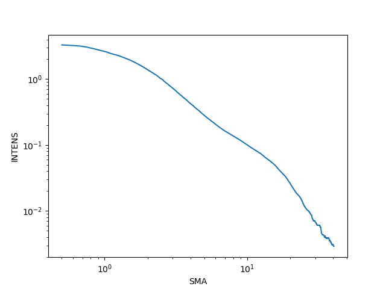
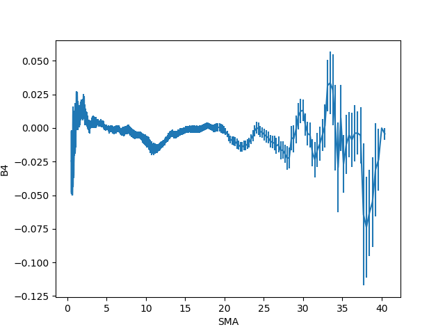
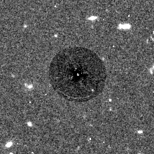
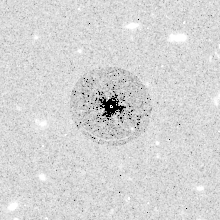

# Tutorial 2 : Surface Photometry Tutorial

Surface photometry of elliptical galaxies using IRAF: `isophote`.

File description:

- `elliptical.fits` : HST/WFPC2 image in F814W filter. 160,000s exposure time.

## Cropping image

```bash
--> imcopy elliptical[496:715,834:1053] small

NAME
    imcopy -- copy images
    
    
USAGE   
    imcopy input output
```

Now we should have a cropped image in our folder called `small.fits`.

## Isophote package

```bash
# loading package
--> stsdas

      +------------------------------------------------------------+
      |       Space Telescope Science Data Analysis System         |
      |                   STSDAS Version 3.18.3                    |
      |                                                            |
      |   Space Telescope Science Institute, Baltimore, Maryland   |
      |   Copyright (C) 2014 Association of Universities for       |
      |            Research in Astronomy, Inc.(AURA)               |
      |       See stsdas$copyright.stsdas for terms of use.        |
      |         For help, send e-mail to help@stsci.edu            |
      |                                                            |
      +------------------------------------------------------------+
stsdas/:
 analysis/      examples        hst_calib/      sobsolete/
 contrib/       fitsio/         playpen/        toolbox/
 describe       graphics/       problems

--> analysis
--> isophote
isophote/:
 bmodel         geompar@        isomap          magpar@
 controlpar@    isoexam         isopall         samplepar@
 ellipse        isoimap         isoplot
```

## Parameter files

Parameter files:
- `controlpar`
- `geopar`
- `samplepar`
- `magpar`

Initial parameters:

- center coordinates (x, y) : using `imexam`
- elasticity                : using `imexam`
- position angle            : using `imexam`
- semimajor length          : using ... eyes :)

After finished the guess,

```bash
# modify parameters and change minimum semi-major axis length = 0.5
--> epar geompar

PACKAGE = isophote
TASK    = geompar
(x0     = 252    ) initial isophote center X
(y0     = 664    ) initial isophote center Y
(ellip0 = 0.08   ) initial ellipticity
(pa0    = -21.   ) initial position angle (degrees)
(sma0   = 29.    ) initial semi-major axis length
(minsma = 0.     ) minimum semi-major axis length
(maxsma = INDEF  ) maximum semi-major axis length
(step   = 0.1    ) sma step between successive ellipses
(linear = no     ) linear sma step ?
(maxrit = INDEF  ) maximum sma lenght for iterative mode
(recente= yes    ) allows finding routine to re-center x0-y0 ?
(xylearn= yes    ) updates pset with new x0-y0 ?
(physica= yes    ) physical coordinate system ?


--> epar samplepar # change the parameters as shown in class ...

PACKAGE  = isophote
TASK     = samplepar
(integrm = bi-linear) area integration mode
(usclip  = 3.       ) sigma-clip criterion for upper deviant points
(lsclip  = 3.       ) sigma-clip criterion for lower deviant points
(nclip   = 1        ) number of sigma-clip iterations
(fflag   = 0.5      ) acceptable fraction of flagged data points
(sdevice = stdgraph ) graphics device for plotting intensity samples
(tsample = none     ) tables with intensity samples
(absangl = yes      ) sample angles refer to image coord. system ?
(harmoni = none     ) optional harmonic numbers to fit
(mode    = al       )

# zero point magnitude is 23.778
--> epar magpar

PACKAGE  = isophote
TASK     = magpar
(mag0    = 19.8292) magnitude of reference source
(refer   = 1.     ) intensity of reference source
(zerolev = 0.     ) intensity of zero (bias) level
(mode    = al     )

--> epar controlpar

PACKAGE  = isophote
TASK     = controlpar
(conver  = 0.05     ) convergency criterion (maximum harmonic amplitud
(minit   = 10       ) minimun no. of iterations at each sma
(maxit   = 50       ) maximun no. of iterations at each sma
(hcenter = no       ) hold center fixed ?
(hellip  = no       ) hold ellipticity fixed ?
(hpa     = no       ) hold position angle fixed ?
(wander  = INDEF    ) maximum wander in successive isophote centers
(maxgerr = 0.5      ) maximum acceptable gradient relative error
(olthres = 1.       ) object locators k-sigma threshold
(soft    = no       ) soft stop
(mode    = al       )
```

## Tutorial Answers

Run,

```bash
# you need to manually change the fitting parameters in the .py file
>> python fit_ellipse.py
```

- (a) 
- (b) -MAG-small.png)
- (c) -ELLIP-small.png)
- (d) -PA-small.png)
- (e) 

- **1. Inspect the residual image that you created. Are there any non-axially symmetric structures left? Is the model a good fit to the data? If it is not, describe how the model differed from the original data. In addition, speculate on the reason why it may not be a good fit.**

I don't feel I fit very well.
Especially there's a strange arc in the subtraction area.
I think the fitted ellipse profile is too wide so the central area of the image has lots of residuals but the outer region is over-subtracted.

This is in linear scale:  


This is in log scale:  


This is the function I used to subtract the model,
```python
fn = lambda x : np.nanmean(
        ( image - x[0] * model - np.nanmedian(image) )**2
    )

res = minimize(fn, (0.1,), method="Nelder-Mead")

residual = image - res.x[0] * model
```

- **2. Compare plot b) above with Figure 1 of the “Instructions on using GALFIT” (https://users.obs.carnegiescience.edu/peng/work/galfit/README.pdf) , which shows Sersic profiles with different indices. Based on what you observe, do you think the galaxy you modeled is a pure elliptical galaxy? If not, how would you describe it?**

Comparing my plot (b) and Figure 1 in the GALFIT paper, my fitting thinks it is an elliptical galaxy (with Sersic index ~ 1).

- **3. Inspect plots c) and d). How do these plots inform your answer to question 2? Or do they?**

Since the behavior of ELLIP and PA are different inside `log(SMA) <= 1` region.
I think there's an inner bulge-like thing within my fitted ellipse profile.

- **4. Is this galaxy disky or boxy?**

It's hard to tell since my fitting is noisy.
And the B4 plot is too noisy to tell anything useful.
But based on observing the inner part, I think it is disky.

## PyRAF Module

Some examples in the pyraf tutorial guide.
Loosely taking notes from the document,
https://lancesimms.com/programs/Python/pyraf/Docs/pyraf_guide.pdf

I feel it's better to read some document before using pyraf.

```python
# run_imstat : run imstatistics on multiple images

import sys
from pyraf import iraf

def run_imstat(input):
    iraf.images()
    for image in input:
        iraf.imstat(image)

if __name__ == "__main__":
    run_imstat(sys.argv[1:])
```

- The statement `iraf.images()` loads the images package

It's quite sneaky for me what happened during the `iraf.images()` step.

### Write a Task in PyRAF

python scripts -> call PyRAF tasks

```python
from pyraf import iraf

def xyz(input):
    print input

parfile = iraf.osfn("<path>xyz.par")
t = iraf.IrafTaskFactory(taskname="xyz", value=parfile,
    function=xyz)
```

- `iraf.images()`, using `__call__()` method for the task object

An example in the document:

`xyz iraf.py`--

```python
from pyraf import iraf
import nc

def _abc(image, verbose, total):
    total = nc.calc_ncounts(image=image, verbose=verbose)
    if verbose:
        print "total =", total

    # Update the value in the par file.
    iraf.ncounts.total = total

parfile = iraf.osfn("home$scripts/ncounts.par")
t = iraf.IrafTaskFactory(taskname="ncounts", value=parfile,
    function=_abc)
```

`nc.py`--

```python
from pyraf import iraf
def calc_ncounts(image, verbose):
    """use imstat to get the total number of counts in an image"""
    iraf.images(_doprint=0) # load the images package
    text_output = iraf.imstatistics(image, fields="npix,mean",
        format=0, Stdout=1)
    values = text_output[0].split()
    # number of pixels mean value
    return float(values[0]) * float(values[1])
```

- `INDEF` -> `None`

### Dealing with I/O Redirection

```bash
listpix x.fits[1][371:375,290:281] wcs="physical" > x.txt.
```

converting to

```python
iraf.listpix("x.fits[1][371:375,290:281]", wcs="physical", Stdout="x.txt")
```

Rather than being printed to the terminal window or written to a file--
```python
xout = iraf.listpix ("x.fits[1][371:375,290:281]", wcs="physical", Stdout=1)

type(xout) # list
```

- `Stdout` : for methods to print output
- `Stderr` : for error

### Task Parameters

`lparam, dparam, eparam, unlearn`

how to handle parameter files?

`defaultParList`, the `runningParList` and the
`currentParLis`

- IRAF tasks are `IrafTask`

- `saveParList(filename=None)`: writes the current parameter list to filename

```python
# example
# Save the parameters to the file hedit.par.
iraf.hedit.saveParList(filename="hedit.par")

# Restore the parameters from the file, and then run hedit.
iraf.hedit.setParList(ParList="hedit.par")
iraf.hedit(mode="h")

# Alternatively, restore parameters from saved file
# and run hedit in one call.
iraf.hedit(ParList="hedit.par")
```

### Functions

`lparam(), dparam(), update(), unlearn()`

```python
# The arguments may be strings ...
lparam("imcopy", "hedit")

# ... or IrafTask objects.
lparam(iraf.imcopy, iraf.hedit)
```

